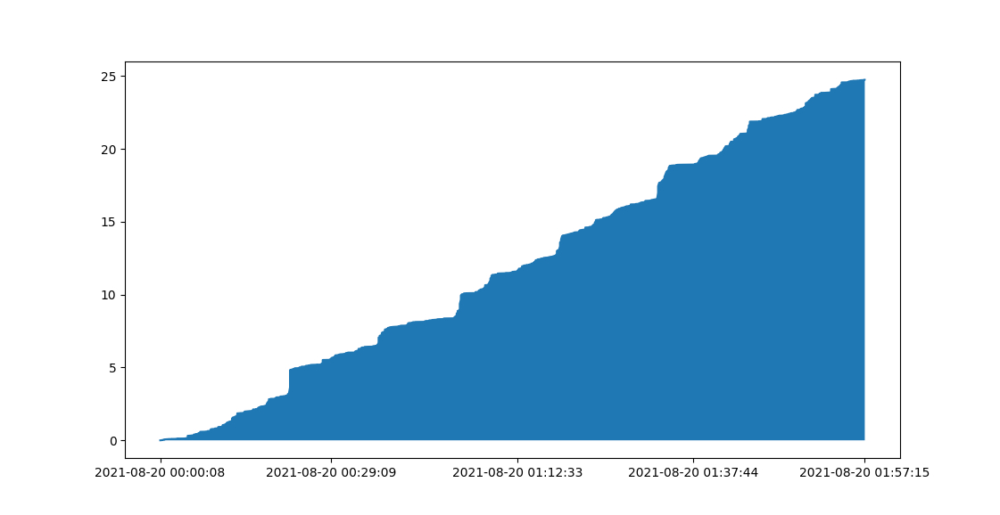

# Arbitrage

Arbitrage is a program that executes cross-exchange arbitrage for any chosen pair of cryptocurrencies. The preset pair chosen is Bitcoin/Tether on okex and binance, but it can be changed to any other pair of currencies and exchanges by changing following in data/dataIO.py
```python
class DataIO:
    def __init__(self, asyncio_loop):
        exchanges_symbols = (
        # change here
            ('okex', 'BTC/USDT'),
            ('binance', 'BTC/USDT'),
        )
```
## Algorithm
The algorithm is in src/arbitrage_algorithm. Its execution and profitbaility relies on getting the order book quickly. It'll compare the bids and asks from both exchanges. If it finds a pair of trade that is profitable, it'll then send it off to the exchanges. The order book is updated approx every 0.15s.
## Usage
To use the program, choose the currencies as shown above and run 'main.py'. To backtest, use the file src/backtrsting, the preset data is from 20/08/2021 for LINK/USDT between Binance and Huobi, it's in the folder backtest.

